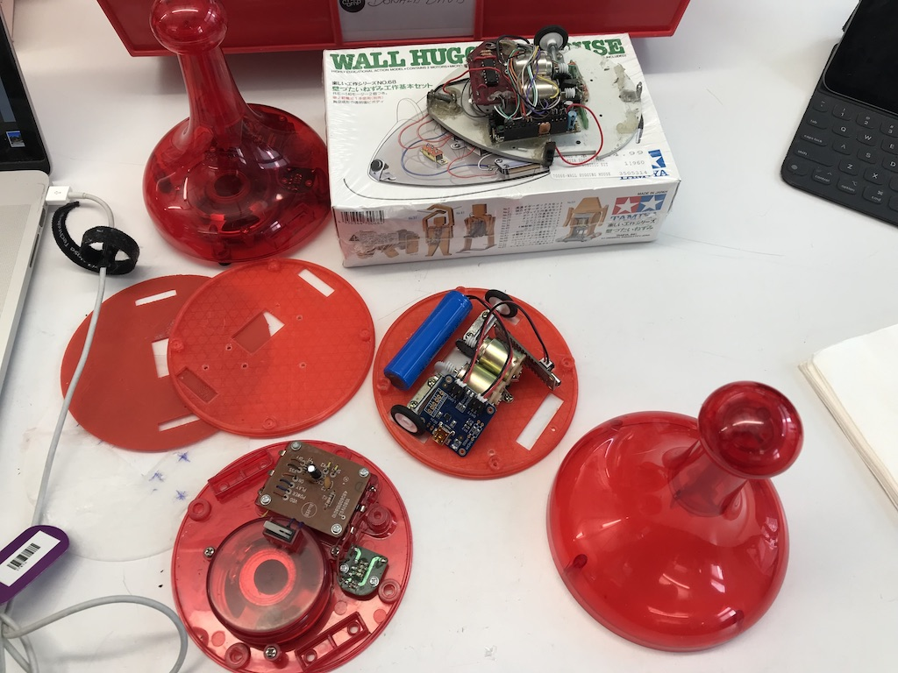

# mysorrybot (3d files and docs for my sorry bot).

Way back when I got myself elected VP of the Portland Area Robotics society we all had two sets of robots we were building. Line Following Maze Solvers and Free Range Navigators. I was more of a line following maze solver so when I found a larger than life sorry piece that fit perfetly within the size limitations for a maze solving robot, I had to try a build based on it. It's what we call kitbashing. Tamaya Wall Hugging Mouse + Huge Sorry Piece. It's also a pretty good comentary on how bad I am as a roboticist.

Here is a [video of my original sorry bot](docs/sorrybot.mov)

Later when I bought my last 3d printer I thought It might be a good idea the revisit the project. My first attempts were in blender and then in bpy (blender python). I could never get blender to work the way I needed it to so I am rewrote things in openSCAD. It is much less painfull.

I thought it would makd a decent [ITP SUMMER CAMP SESSION](docs/ITPClassNotes.md)